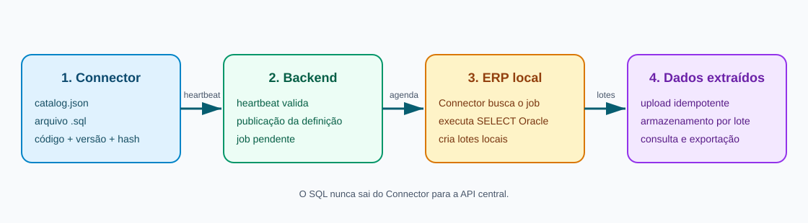

# Consultas do Connector: criação, publicação e carga

Este guia descreve como disponibilizar uma nova consulta do ERP no Concilia ERP. A consulta é instalada e executada **no Connector**, dentro da rede do cliente. O backend guarda a definição auditável, agenda o trabalho e recebe somente os resultados.

No sistema, este conteúdo está disponível em **Documentação do Connector** exclusivamente para o perfil `ADMIN`, com opções de exportação e compartilhamento em PDF.



## Regra principal

Crie e publique a consulta no Connector **antes** de agendá-la no backend. O backend só entrega o job se o heartbeat do Connector tiver informado o mesmo:

- código da consulta (`queryId`);
- versão (`version`);
- SHA-256 do SQL normalizado (`trim()`);
- status habilitado.

O SQL não é enviado pelo backend ao ERP.

## 1. Criar os arquivos no Connector

Exemplo já utilizado para títulos financeiros:

| Item | Exemplo |
| --- | --- |
| Código | `FINANCEIRO_TITULOS_V1` |
| Arquivo de catálogo | `queries/catalog.json` |
| Arquivo SQL | `queries/financeiro/financeiro_titulos_v1.sql` |
| Versão do catálogo | `1` |
| Limite de lote | `500` registros |

No `catalog.json`, inclua a definição com os metadados e parâmetros aceitos:

```json
{
  "queryId": "FINANCEIRO_TITULOS_V1",
  "version": 1,
  "description": "Consulta de títulos financeiros",
  "file": "financeiro/financeiro_titulos_v1.sql",
  "enabled": true,
  "timeoutSeconds": 60,
  "maxRows": 10000,
  "batchSize": 500,
  "parameters": [
    { "name": "empresa", "type": "integer", "required": true, "minimum": 1 },
    { "name": "dataInicial", "type": "date", "required": true },
    { "name": "dataFinal", "type": "date", "required": true }
  ]
}
```

O arquivo `queries/financeiro/financeiro_titulos_v1.sql` contém somente uma consulta de leitura:

```sql
SELECT
  T.NROEMPRESA,
  T.SEQPESSOA,
  T.NROTITULO,
  T.DTAEMISSAO,
  T.DTAVENCIMENTO,
  T.VLRORIGINAL,
  T.VLRABERTO
FROM CONCILIAERP.VW_TITULOS_FINANCEIROS T
WHERE T.NROEMPRESA = :empresa
  AND T.DTAEMISSAO >= :dataInicial
  AND T.DTAEMISSAO < :dataFinal + 1;
```

Outro exemplo, para carga incremental de produtos, está em `queries/master-data/master_products_v1.sql`:

```sql
SELECT
  p.seqproduto AS product_id,
  p.desccompleta AS product_description,
  p.dtahoralteracao AS product_changed_at,
  f.seqfamilia AS family_id,
  f.dtahoralteracao AS family_changed_at
FROM consinco.map_produto p
JOIN consinco.map_familia f ON f.seqfamilia = p.seqfamilia
WHERE p.dtahoralteracao >= :updatedAfter
   OR f.dtahoralteracao >= :updatedAfter
ORDER BY p.dtahoralteracao, p.seqproduto;
```

### Regras do SQL

- Somente uma instrução `SELECT` ou `WITH ... SELECT`.
- Não use `INSERT`, `UPDATE`, `DELETE`, DDL, PL/SQL, transações ou SQL remoto.
- Use bind variables declaradas no catálogo, como `:empresa` e `:updatedAfter`.
- Não aceite nomes de tabelas, colunas ou fragmentos SQL como parâmetros.
- O `batchSize` não pode ser maior que `maxRows` e deve respeitar o limite de payload da API.

## 2. Validar e disponibilizar no Connector

1. Execute `validate-catalog` no Connector.
2. Teste a consulta com o usuário Oracle configurado no ambiente de homologação.
3. Publique os arquivos junto ao Connector ou crie a consulta pelo instalador, em **Consultas SQL**.
4. Reinicie/atualize o serviço e aguarde o heartbeat.
5. Confirme que o Connector aparece como ativo e que anunciou a capability da consulta.

O heartbeat informa o hash do conteúdo do arquivo SQL, sem a quebra de linha final. Portanto, o texto publicado no backend deve ser idêntico ao SQL local após `trim()`.

## 3. Publicar no backend e agendar

No painel, acesse **Consultas do Connector** como `ADMIN`:

1. Clique em **Nova consulta**.
2. Informe o mesmo código, descrição, SQL, timeout, máximo de linhas e lote do catálogo local.
3. Publique a versão e mantenha-a habilitada.
4. Clique em **Agendar**, escolha o `connectorId` ativo e informe os parâmetros da carga.
5. Acompanhe o job: `PENDING` → `DISPATCHED` → `UPLOADING` → `COMPLETED`.

O Connector consulta `GET /connectors/jobs/next`, executa a consulta localmente e envia os resultados em lotes para `POST /connectors/jobs/:id/batches`. Ao concluir todos os lotes, chama `POST /connectors/jobs/:id/complete`.

> **Limitação atual da tela:** o agendamento do frontend envia `parameters: {}`. Consultas com parâmetros obrigatórios, como `FINANCEIRO_TITULOS_V1`, exigem que a tela/API seja ampliada para coletar esses valores antes do agendamento. Sem isso, o Connector retorna `INVALID_PARAMETERS`.

## 4. Exibir a nova consulta em Dados extraídos

A ingestão do backend armazena registros de qualquer `queryCode`, mas a tela e a API de **Dados extraídos** aceitam uma lista fixa de tipos. Para uma nova consulta aparecer ali, faça estes ajustes coordenados:

| Local | Alteração |
| --- | --- |
| Backend: `connector-data.controller.ts` | Adicionar o código à lista `types`. |
| Backend: `connector-extraction.service.ts` | Definir `sourceKeys` para garantir atualização idempotente; opcionalmente definir `changeColumns` para a data de alteração. |
| Frontend: `connector-data.service.ts` | Adicionar o código e rótulo em `extractionTypes`. |
| Frontend: tela de dados | Criar colunas específicas apenas se a consulta precisar de uma visualização além do payload completo. |

Sem uma `sourceKey` específica, o backend usa o JSON inteiro como chave. Isso funciona como fallback, mas não é ideal para identificar atualizações do mesmo registro.

## Versionamento seguro

Não altere o SQL de uma consulta que já possui jobs em andamento. Para mudanças incompatíveis, crie uma nova consulta, por exemplo `FINANCEIRO_TITULOS_V2`, com seu próprio arquivo `financeiro_titulos_v2.sql`, valide no Connector e só então publique/agende no backend. Mantenha a versão anterior habilitada até a conclusão ou cancelamento dos jobs existentes.

## Checklist de homologação

- [ ] Código, versão e SQL local definidos.
- [ ] Catálogo validado e consulta Oracle testada.
- [ ] Heartbeat aceitou código, versão e SHA-256.
- [ ] Definição equivalente publicada e habilitada no backend.
- [ ] Parâmetros enviados no agendamento, quando aplicável.
- [ ] Lotes recebidos e job finalizado como `COMPLETED`.
- [ ] Código incluído na lista de tipos de dados extraídos, se a carga precisar ser visualizada/exportada no painel.
